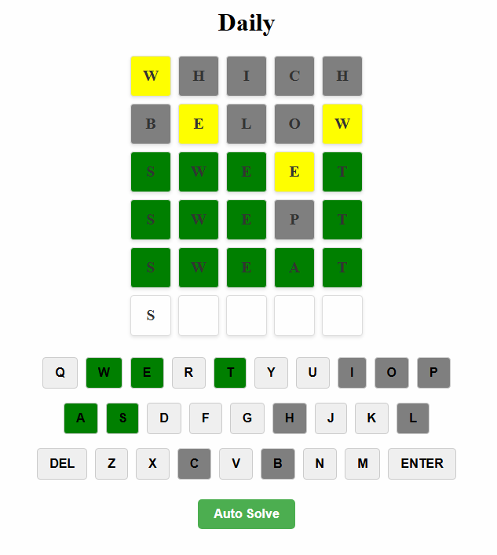
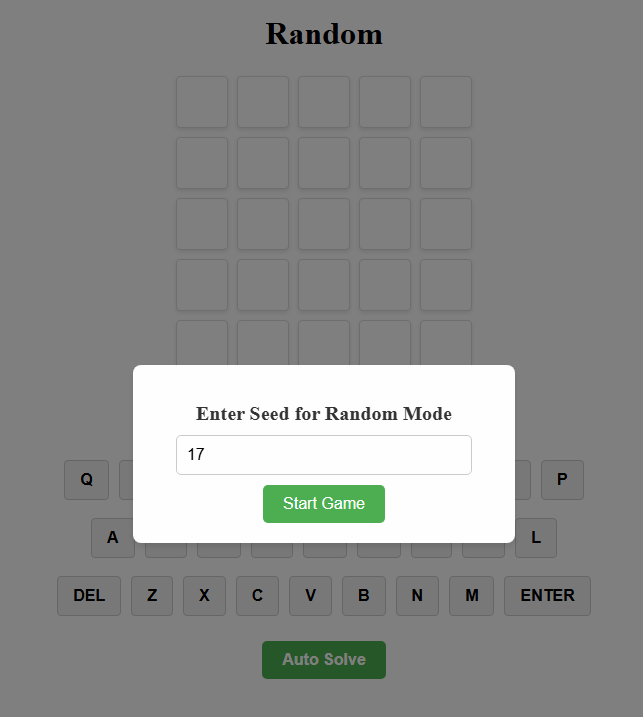
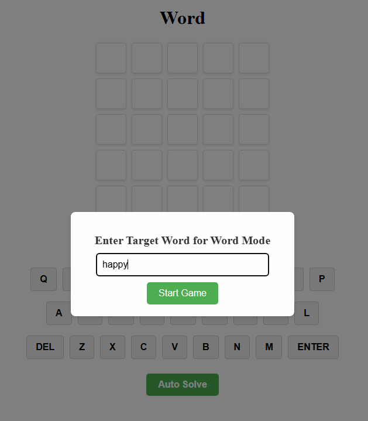

# Wordle Game

## Overview
This Wordle game is a browser-based word puzzle application that features engaging graphics and multiple game modes. It is designed to provide a fun and challenging word-guessing experience, with the added functionality of an **Auto Solve** button that can solve the puzzle automatically. The game communicates with an API to retrieve and validate words for each game mode.

## Features

1. **Daily Mode**:
   - Guess the word of the day.
   - The same word is provided for everyone, updated daily.

2. **Random Mode**:
   - Enter a seed to generate a random word to guess.
   - Each seed corresponds to a specific word, ensuring replayability.

3. **Word Mode**:
   - Choose your own target word for others to guess.
   - Perfect for testing or challenging friends.

4. **Auto Solve**:
   - A button that automatically solves the puzzle for you.
   - Uses advanced algorithms to refine guesses based on feedback.

5. **Game Graphics**:
   - Responsive and visually engaging board for word input and feedback.
   - Real-time feedback updates with color-coded tiles:
     - **Green**: Correct letter in the correct position.
     - **Yellow**: Correct letter in the wrong position.
     - **Gray**: Letter not in the word.

## API Integration
The game utilizes an external API to retrieve words and validate guesses for all three modes. The API endpoints and documentation can be found at:
[https://wordle.votee.dev:8000/redoc](https://wordle.votee.dev:8000/redoc)

## Getting Started

### Prerequisites
- A modern web browser (Google Chrome, Firefox, or Edge recommended).
- An active internet connection to fetch API data.

### Installation
1. Clone the repository:
   ```bash
   git clone https://github.com/dqtienxdd/wordle
   ```
2. Navigate to the project directory:
   ```bash
   cd wordle
   ```
3. Start the server:
   ```bash
   python app.py
   ```
4. Open your browser and go to:
   ```
   http://127.0.0.1:5000/
   ```

### How to Play

1. **Choose a Mode**:
   - Select "Daily," "Random," or "Word" from the homepage.

2. **Random Mode**:
   - Enter a seed to generate the random word.

3. **Word Mode**:
   - Enter a custom target word to set the puzzle.

4. **Start Guessing**:
   - Use the on-screen keyboard or your physical keyboard to input guesses.
   - Press "Enter" to submit.

5. **Use Auto Solve**:
   - Click the **Auto Solve** button to let the game solve itself.

### Controls

- **On-Screen Keyboard**:
  - Click letters to input guesses.
  - Use "Del" to delete and "Enter" to submit.
- **Physical Keyboard**:
  - Type letters and use backspace to delete.

## Screenshots

### Game Board


### Random Mode Popup


### Word Mode Popup


## API Documentation
The game communicates with the [Wordle API](https://wordle.votee.dev:8000/redoc) for:

- **Daily Mode**: Retrieve the word of the day.
- **Random Mode**: Generate a word based on the provided seed.
- **Word Mode**: Validate guesses against the target word.

## Technologies Used

- **Frontend**:
  - HTML
  - CSS
  - JavaScript (with modular imports)
- **Backend**:
  - Flask (Python)
- **External APIs**:
  - [Wordle API](https://wordle.votee.dev:8000/redoc)

## Contributing
Contributions are welcome! Feel free to fork the repository and submit a pull request.

## License
This project is licensed under the MIT License.

## Acknowledgements
- [Wordle API](https://wordle.votee.dev:8000/redoc) for powering the game's word generation and validation.
- All contributors for their efforts in making this project a success.

## References
- The idea for the game graphics is based on this repository: https://github.com/Kaushik268mlore/THE-WORDLE

